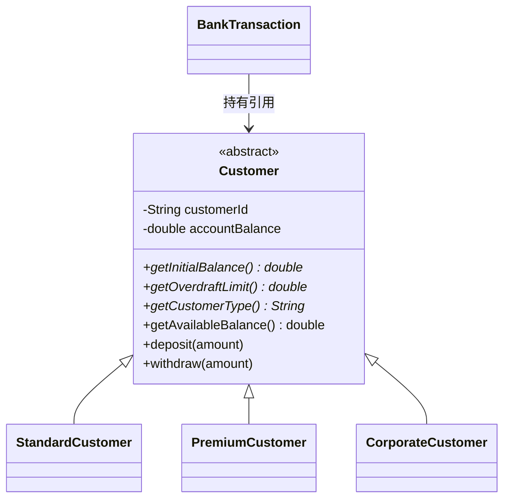

# 项目修改说明文档

本文档记录本次针对《银行交易记录系统》所做的全部修改内容，共三项需求，均已实现、编译并通过运行验证。

---

## 修改一：Transaction Type 改用枚举（Enum）重构

### 修改目的
原程序使用 `String` 表示交易类型（如 `"Deposit"`、`"Withdrawal"`），存在拼写错误风险且类型不安全。改用枚举后，编译器可在编译期检查非法值，代码更规范。

### 新增文件
- **[TransactionType.java](TransactionType.java)**
  定义枚举 `TransactionType`，包含四个常量：`DEPOSIT`、`WITHDRAWAL`、`TRANSFER`、`PAYMENT`，每个常量绑定一个用于显示的 `displayName`（如 "Deposit"），并重写 `toString()` 保证打印格式与原来完全一致。

### 修改文件
- **[BankTransaction.java](BankTransaction.java)**
  - 字段 `transactionType` 类型由 `String` 改为 `TransactionType`
  - 构造方法参数类型同步修改
  - `applyTransaction()` 中的 `switch` 分支由字符串字面量（`case "Deposit":`）改为枚举常量（`case DEPOSIT:`）

- **[BankTransactionRecordSystem.java](BankTransactionRecordSystem.java)**
  - `readTransactionType()` 返回类型改为 `TransactionType`，菜单选择后直接返回对应枚举值
  - `requiresSufficientBalance()` 参数类型改为 `TransactionType`，比较方式由 `.equals("Transfer")` 改为 `== TransactionType.TRANSFER`
  - 主流程中所有涉及交易类型判断的代码同步改为枚举比较

---

## 修改二：引入 try-catch 保证程序完整运行

### 修改目的
原程序在输入意外提前结束（例如通过文件或管道输入但行数不足）时，会抛出未捕获的 `NoSuchElementException`，导致程序崩溃并打印堆栈跟踪，用户体验差。

### 修改文件
- **[BankTransactionRecordSystem.java](BankTransactionRecordSystem.java)**
  - 新增 `import java.util.NoSuchElementException;`
  - 将 `main()` 方法中标题打印、5 位客户信息录入循环、结果显示等主体逻辑整体包裹进 `try` 块
  - 新增三层异常捕获：
    1. `catch (NoSuchElementException e)`：输入提前耗尽时给出友好提示，如"Input ended unexpectedly. Please provide complete information for all 5 customers."
    2. `catch (IllegalStateException e)`：`Scanner` 被意外关闭时的兜底提示
    3. `catch (Exception e)`：兜底捕获其他未预期异常并打印错误信息
  - 使用 `finally { scanner.close(); }` 确保无论是否发生异常，`Scanner` 资源都能被正确释放

### 验证效果
使用行数不匹配的输入测试，程序不再抛出堆栈跟踪导致进程以异常退出码结束，而是打印友好提示后正常结束。

---

## 修改三：使用继承（Inheritance）与多态（Polymorphism）支持不同客户类型

### 修改目的
银行新增三种客户等级：`Standard`（标准）、`Premium`（高级）、`Corporate`（企业）。要求设计上使用继承与多态，使得**未来新增客户类型时，不需要修改现有业务逻辑**。

### 设计思路
将“客户”从原本内嵌在 `BankTransaction` 中的普通字段，抽取为独立的类层次结构：



不同客户等级的差异（初始余额、透支额度、类型名称）通过子类各自实现抽象方法体现，`BankTransaction` 及主程序只依赖 `Customer` 抽象类型，不感知具体是哪个子类（多态）。

### 新增文件
- **[Customer.java](Customer.java)**
  抽象基类，包含通用字段 `customerId`、`accountBalance` 及通用方法 `deposit()`、`withdraw()`、`getAvailableBalance()`；声明 3 个抽象方法交由子类实现：
  - `getInitialBalance()` — 该等级初始余额
  - `getOverdraftLimit()` — 该等级透支额度
  - `getCustomerType()` — 等级名称（用于显示）

- **[StandardCustomer.java](StandardCustomer.java)**
  初始余额 `99999.00`，透支额度 `0`（不允许透支）。

- **[PremiumCustomer.java](PremiumCustomer.java)**
  初始余额 `199999.00`，透支额度 `5000.00`。

- **[CorporateCustomer.java](CorporateCustomer.java)**
  初始余额 `999999.00`，透支额度 `50000.00`。

### 修改文件
- **[BankTransaction.java](BankTransaction.java)**
  - 不再自行保存 `customerId` 和 `accountBalance`，改为持有一个 `Customer customer` 引用
  - `getCustomerId()`、`getAccountBalance()`、`addToBalance()` 等方法全部委托给 `customer` 对象的多态方法
  - 新增 `getCustomerType()` 方法，委托给 `customer.getCustomerType()`
  - 移除了原来写死的 `DEFAULT_ACCOUNT_BALANCE` 静态常量（初始余额现由各客户子类自行决定）
  - `displayTransaction()` 新增一行 "Customer Type" 显示客户等级

- **[BankTransactionRecordSystem.java](BankTransactionRecordSystem.java)**
  - 新增 `CUSTOMER_TYPE_PATTERN` 校验规则（仅允许输入 1-3）
  - 新增 `readCustomerType(Scanner, customerId)` 方法：显示客户等级菜单（1.Standard / 2.Premium / 3.Corporate）并读取合法选择
  - 新增 `createCustomer(choice, customerId)` 工厂方法：根据选择创建对应的 `Customer` 子类对象。**这是未来新增客户类型时唯一需要修改的地方**——只需新增一个 `Customer` 子类并在此方法中加一个 `case` 分支，其余读取、校验、交易、显示等业务逻辑完全不需要改动
  - 主流程中录入顺序调整为：Customer ID → Customer Type → Account Number → Transaction Type → Transaction Amount →（如为 Transfer）Transfer To Account
  - 可用余额判断改为调用 `customer.getAvailableBalance()`（账户余额 + 透支额度），使不同等级客户的透支规则自动生效

### 输入顺序变化说明
由于新增了客户等级选择步骤，控制台交互顺序发生变化，从：
```
Customer ID → Account Number → Transaction Type → Transaction Amount → (Transfer To Account)
```
调整为：
```
Customer ID → Customer Type(1-3) → Account Number → Transaction Type → Transaction Amount → (Transfer To Account)
```

---

## 配套示例文件更新

- **[sample_input.txt](sample_input.txt)**：按新的录入顺序重新整理，5 条记录覆盖 Standard/Premium/Corporate 三种客户类型，以及 Deposit/Withdrawal/Transfer/Payment 四种交易类型（含一笔转账）。
- **[sample_output.txt](sample_output.txt)**：使用更新后的 `sample_input.txt` 实际运行程序并捕获真实输出回填，包含新增的 "Customer Type" 菜单提示、记录展示中的 "Customer Type" 行，以及正确反映透支额度的账户余额（如 Corporate 客户转账后余额为 `999198.25`）。

---

## 验证方式

每项修改均执行以下验证：
1. `javac *.java` 编译全部源文件，确认无编译错误
2. 使用测试输入通过管道运行程序（`Get-Content 测试文件 | java BankTransactionRecordSystem`），核对控制台输出是否符合预期
3. 编译产生的 `.class` 文件在验证完成后已清理，不纳入版本管理

## 项目当前文件结构

```
BankTransaction.java              交易记录类（持有 Customer 引用）
BankTransactionRecordSystem.java  主程序：输入、校验、创建对象、异常处理、汇总显示
TransactionType.java              交易类型枚举
Customer.java                     客户抽象基类
StandardCustomer.java             标准客户子类
PremiumCustomer.java              高级客户子类
CorporateCustomer.java            企业客户子类
README.md / introduction.md       项目说明文档
sample_input.txt / sample_output.txt  示例输入与输出
```
